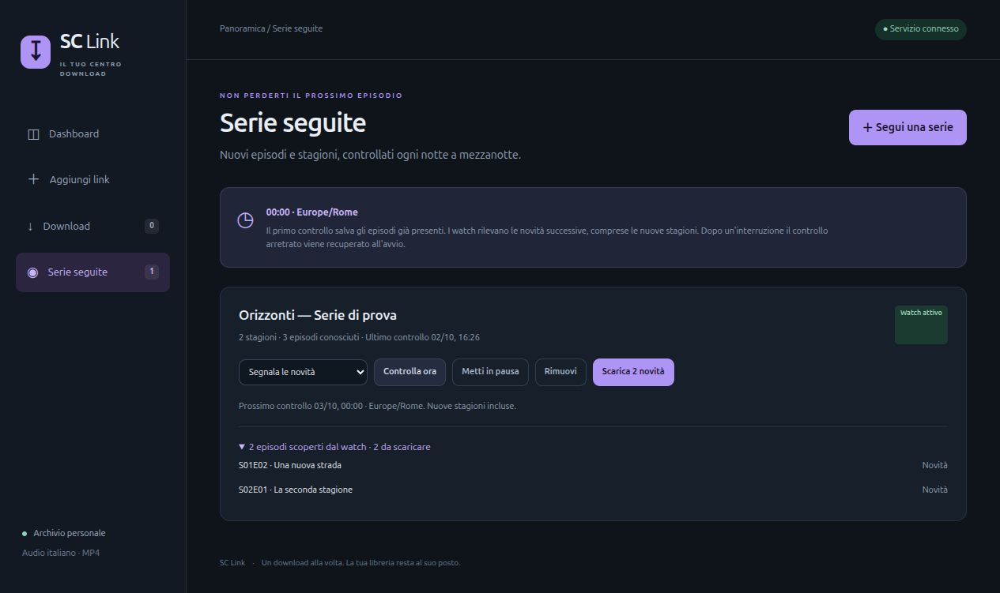

# SC Link

Un centro download per la propria libreria multimediale: incolla il link di
un film o di una serie da **StreamingCommunity o AnimeUnity**, scegli gli episodi,
segui la coda e controlla le novità.
Interfaccia italiana responsive, senza framework frontend o risorse esterne.
Usare esclusivamente contenuti per cui si possiedono i diritti o l'autorizzazione.



## Funzioni

- **Dashboard** con conteggi, coda, spazio libero, stato database/worker/scheduler
  e registro degli ultimi controlli delle serie.
- **Selezione di più stagioni** nello stesso invio. Seleziona una stagione
  intera, tutti gli episodi della serie o singoli episodi: la scelta rimane
  mentre apri altre stagioni. Massimo 200 episodi per invio e 200 job attivi.
- **Watch delle serie**, persistenti in SQLite: controllo quotidiano alle
  **00:00 Europe/Rome**, comprese nuove stagioni. Modalità “segnala le novità”
  o “scarica automaticamente”, pausa/riattivazione e controllo manuale.
- **Coda persistente**, deduplicazione, annullamento e nuovo tentativo.
- **Verifica dei file** completati con ffprobe: audio, video e durata positiva.
  Il controllo non analizza ogni fotogramma; un errore resta visibile senza
  cancellare i file o cambiare la cronologia del download.
- Un download alla volta, quattro richieste di segmenti in parallelo,
  MP4 senza ricodifica, audio italiano quando presente (oppure originale per gli anime non doppiati).
- Cartelle `Movies` e `TV` compatibili con una libreria Jellyfin separata.
  Temporanei isolati in `.incomplete/<job-id>`.

## Avvio con Docker Compose

Richiede Docker con Compose, sistema x86_64 compatibile con l'immagine del
motore e spazio su disco. Jellyfin è facoltativo e non viene installato.

```bash
git clone https://github.com/samuu98/sc-link.git
cd sc-link
cp .env.example .env
mkdir -p state downloads
docker compose up -d
```

Apri **http://localhost:8000/**. Le cartelle devono essere scrivibili da
`PUID:PGID` (default 1000:1000); imposta i tuoi UID/GID nel file `.env`.

Per usare il servizio da altri dispositivi della LAN imposta in `.env`:

```dotenv
BIND_ADDRESS=192.168.1.100
PUBLIC_HOST=192.168.1.100:8000
```

Sostituisci l'indirizzo con quello del tuo server e riavvia con
`docker compose up -d`. `PUBLIC_HOST` deve coincidere con l'indirizzo e la
porta usati nel browser. Il dominio della sorgente è configurabile tramite
`SOURCE_HOST`; verificare il nuovo dominio prima di cambiarlo.

`DOWNLOAD_DIRECTORY` e `STATE_DIRECTORY` possono indicare cartelle assolute
su un disco dati. `TZ` imposta il fuso dei controlli (default Europe/Rome).
Il sistema ospitante deve avere un orologio corretto.

## Come funziona il watch

Analizza il link di una serie e premi **Segui la serie**. Il primo controllo
registra tutti gli episodi già disponibili come fotografia iniziale: **non
scarica automaticamente le stagioni arretrate**. Usa la selezione manuale
per aggiungerle alla coda. I controlli successivi rilevano nuovi episodi e
nuove stagioni, senza riproporre quelli già scoperti.

Il controllo parte entro circa 20 secondi dalla mezzanotte. La data dell'ultimo
controllo programmato è persistente: se il servizio era fermo, viene recuperato
un controllo all'avvio. Il fuso usa giorni di calendario, compreso il cambio
tra ora solare e legale. I controlli manuali non saltano il prossimo controllo
programmato. Uno scheduler interno gestisce tutti i watch: non serve cron e
non serve un'automazione esterna. **Avvia un solo processo Uvicorn**.

In modalità automatica le novità vanno in coda; se manca spazio o la coda è
piena, rimangono registrate e visibili. Il watch proverà a metterle in coda
al controllo successivo, oppure puoi usare “Scarica novità”. I download falliti
o annullati richiedono “Riprova”: il watch non avvia tentativi infiniti.
Una serie in pausa non viene controllata; rimuoverla non cancella i video.

## AnimeUnity

Incolla un link `https://www.animeunity.so/anime/<id>-<slug>` (anche il dominio
senza `www` è accettato). Il servizio legge metadati ed episodi pubblicati
tramite `info_api`, con paginazione per le serie lunghe. Il numero di episodi
previsti nella scheda non viene confuso con quelli disponibili. Se un batch
fallisce, il catalogo incompleto non viene accettato dal watch.

Serie/ONA/OVA/Special vengono raccolte nella stagione 1 della pagina specifica,
con numero episodio originale, inclusi speciali decimali e intervalli. I film
con un unico video vanno in Movies; gli altri contenuti in TV. Se il sito
pubblica una nuova parte su un'altra pagina, **aggiungi un watch separato**:
i titoli correlati non vengono seguiti automaticamente. La UI indica la fonte
e la modalità di raccolta degli episodi.

Il watch può segnalare o scaricare nuove uscite esattamente come per
StreamingCommunity. Gli ID di job e watch sono distinti per sorgente;
aggiungere AnimeUnity non modifica i download già presenti. Le edizioni ITA
richiedono l'italiano, le edizioni originali il giapponese se esistono più tracce;
per una singola traccia muxata viene usato l'audio della sorgente. Il doppiaggio
mostrato nella UI è quello dichiarato dal sito, non un riconoscimento dell'audio.
`ANIMEUNITY_HOST` configura il dominio, condiviso con il motore.

## Persistenza e aggiornamento

`state/jobs.sqlite3` contiene coda, watch, fotografia degli episodi, novità e
storico (ultimi 200 controlli, 30 mostrati in dashboard). La migrazione aggiunge
tabelle e campi senza eliminare i job esistenti. La chiave dei watch è
`(provider, title_id)`; i watch esistenti vengono preservati come StreamingCommunity. Non conserva URL dei flussi,
cookie o token della sorgente.

Prima di aggiornare: ferma il container, salva una copia dei sorgenti, del
Compose, del file `.env` privatamente e del database, quindi distribuisci la
nuova versione. Conserva il commit e l'immagine precedenti per il ripristino.
Non ripristinare un database mentre il servizio è attivo.

```bash
docker compose ps
docker compose logs --tail 30 downloader
docker compose stop
# Esegui qui backup/aggiornamento dei sorgenti e dello stato.
docker compose up -d
```

`docker compose down` conserva database, video e temporanei nei bind mount.
Non usare pulizie di volumi o cancellazioni della libreria per aggiornare.
I job in coda riprendono; quelli interrotti mostrano “Riprova”. I file completati
vengono pubblicati tramite hard link atomico, senza sovrascrivere file esistenti.
La riserva minima è 5 GiB, con stima dello spazio per segmenti, concatenazione
e mux; non prenota spazio contro scritture di altre applicazioni.

## Accesso e limiti

Il servizio non ha autenticazione: usare solo localhost o una LAN fidata.
Non pubblicarlo su Internet senza aggiungere autenticazione. Controlli Host e
Origin impediscono richieste browser da origini arbitrarie, ma non sostituiscono
un login. Il repository pubblico contiene codice, non espone il servizio.

La disponibilità dipende dal sito, dal suo dominio e dal formato del player.
Se ci sono più tracce e manca l'italiano viene segnalato un errore; per una
traccia muxata viene usato l'audio offerto dalla sorgente. I sottotitoli non
vengono scaricati in questa versione.

## API principali

- `POST /api/inspect` — `{"url":"https://…/it/titles/…","season":1}`.
- `POST /api/downloads` — film: `{"url":"…"}`; serie:
  `{"url":"…","selections":[{"season":1,"episode_ids":[101,102]},{"season":2,"episode_ids":[201]}]}`.
  Anche il vecchio formato `season`/`episode_ids` è supportato.
- `GET /api/downloads`; `POST /api/downloads/{id}/cancel|retry|verify` con `{}`.
- `POST /api/watches` — `{"url":"…","mode":"notify"}` oppure `"auto"`.
- `GET /api/watches`; `POST /api/watches/{id}/check|download|remove` con `{}`.
- `POST /api/watches/{id}/settings` — `{"mode":"auto","enabled":true}`.
- `GET /api/dashboard`, `/api/health`, `/api/info`.

## Sviluppo e test

```bash
python3 -m venv .venv
. .venv/bin/activate
pip install -r requirements-dev.txt
python -m unittest -v
node --check app.js
```

I test usano cataloghi simulati e cartelle temporanee; non effettuano download
reali. `verify_source.py` è un collaudo separato nel container del motore:
richiede rete e scarica una breve clip; non avviarlo sul database in uso.
La CI esegue i test di coda, migrazione, watch, selezione multipla e verifica.

## Motore e licenza

Il servizio richiama le funzioni del motore
[EdoardoFiore/StreamingCommunity-downloader](https://github.com/EdoardoFiore/StreamingCommunity-downloader),
licenza MIT, commit `565bf268eba751e1ee5f33298168b7287dc4ade3`.
L'immagine è fissata al digest in Compose. Il pannello, gli account e i processi
periodici del progetto originale non vengono avviati. Il motore resta una
dipendenza esterna; il suo codice non viene copiato in questo repository.
Il motore fornisce anche `app.core.animeunity.download_anime_episode`; il
modulo `animeunity_provider.py` normalizza metadati e cataloghi per SC Link.
Il codice specifico di SC Link è distribuito con licenza [MIT](LICENSE).
